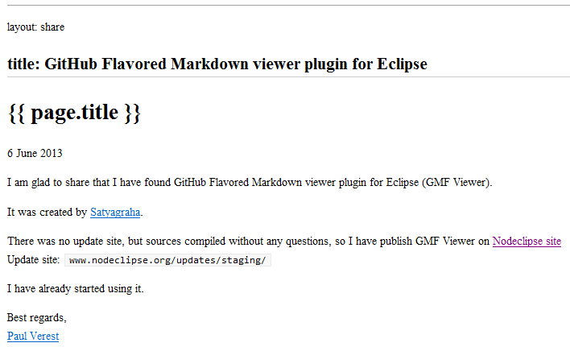

{{ page.title }}
================

6 June 2013

I am glad to share that I have found GitHub Flavored Markdown viewer plugin for Eclipse (GMF Viewer).

It was created by [Satyagraha](https://github.com/satyagraha).

There was no update site, but sources compiled without any questions, so I have publish GMF Viewer
 on [Nodeclipse site](http://www.nodeclipse.org/)  
Update site: `www.nodeclipse.org/updates/staging/`

I have already started using it.

We will let you know if there are some issues.

Best regards,  
[Paul Verest](https://github.com/PaulVI)
