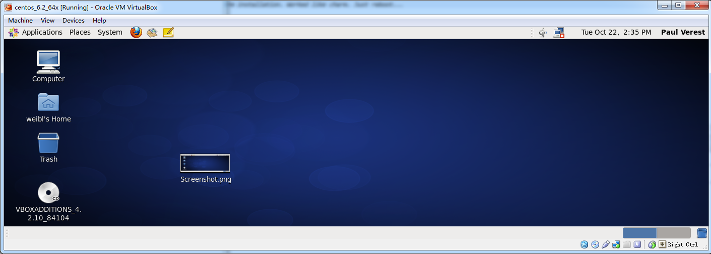

### {{ page.title }}

30 August 2013
 by Paul Verest

NOTE: This is [open-source article, that you can extend](https://github.com/Nodeclipse/www.nodeclipse.org/tree/gh-pages/_posts).

### Basic

1. Insert Addon CD images Devices -> Install Guest Additions ...
2. Launch installer for your OS

In CentOS 6.2 popup will come to enter root password and confirm installation. Worked like charm. Just reboot... 
and the screen can be any size and mouse smoothly intaract with any OS's applications.

This however failed on CentOS 5.4, so below are additional steps needed.

CheatSheet based on <http://www.processworks.de/blog/2009/09/install-virtualbox-guest-additions-in-centos-redhat-linux-client/>

### Install VirtualBox Guest Additions in CentOS (RedHat) Linux Guest

	cd /media/VBOXADDITIONS_3.0.6_52128/

1. Cannot execute .run file

	sh VBoxLinuxAdditions-amd64.run

If any error, do step 2 

2. Installer complains about missing gcc and Linux kernel headers

	yum update kernel
	yum install gcc
	yum install kernel-devel
	
again

	sh VBoxLinuxAdditions-amd64.run
	
3. Reboot	

	reboot
	
After reboot, in VirtualBox select 
 
- Devices -> Shared ClipBoard -> Bidirectonal
- Devices -> Drag-n-Drop -> Bidirectonal	
	
### Some useful Linux commands	
	
Check disk free space `df`	

	df -h
	
`du` shows how much space one ore more files or directories is using
	
	du -sh

taken from <http://www.cyberciti.biz/faq/check-free-space/>