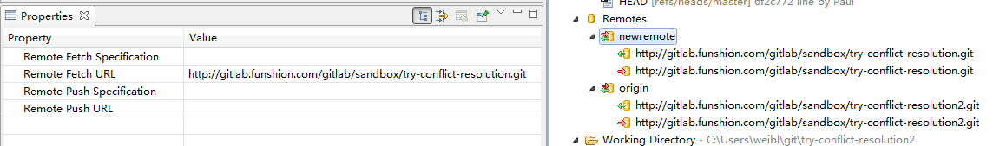
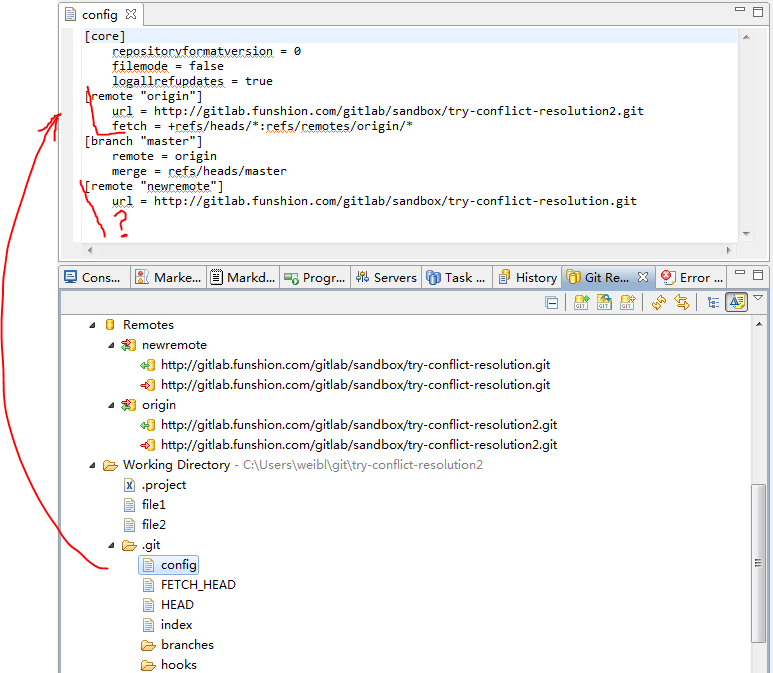

# EGit Notes

It is nice that Eclipse goes now with [EGit](http://eclipse.org/egit/)
 (git client on top of [JGit Java implementation of Git](http://www.eclipse.org/jgit/)).
This means that for basic operations you don't need `git` command line tool
 (and to install [msysgit](http://msysgit.github.io/), if you are on Windows).
However EGit introduces its own features and bugs, and some time or for some operations, you should wish to have 'git'.
I recommend `git` to be installed, and use it to get another view or for some specific operations.

## Remote

`git remote` is used to specify location of git repository on server.

###  git remotes in Eclipse Kepler

Use Properties View to look at remote values

newremote remote was added using EGit, notice that Specifiation is missing

Look at `.git/config` file

As usual, final point were set after looking at documentation.  
<http://wiki.eclipse.org/EGit/User_Guide#Adding_a_Remote_Configuration>