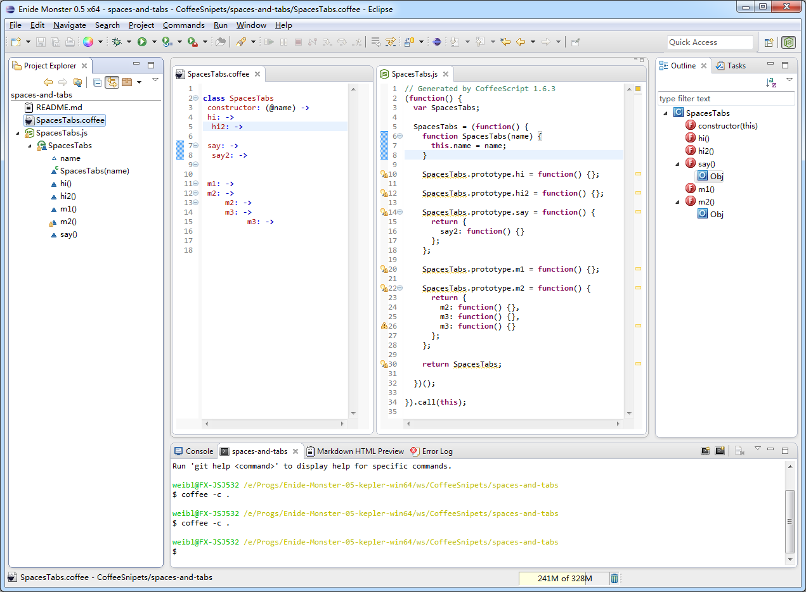

# Enide Monst(e)r

            	

            	
            	
            	

            	

[README](README)

Latest version is shown on <a href="http://marketplace.eclipse.org/content/enide-monster">Marketplace</a>.

            	
            	

