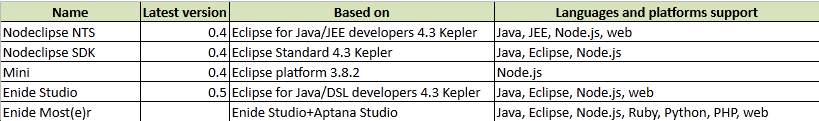

# What Eclipse

by Paul Verest

[Downloadable standalone Nodelcipse solutions](http://sourceforge.net/projects/nodeclipse/) are all [Eclipse](http://eclipse.org/)-based.

Now there is Nodeclipse NTS, Nodeclipse SDK, Mini, Enide Studio and Enide Most(e)r.
You might be confused "what should be used?".

It is up to you to decide. It depends on what you use more.
I am actually interested what solution is downloaded more often.
[Enide Studio](http://www.nodeclipse.org/enide/studio/) is currently by me every day.

<iframe width="700" height="167" frameborder="0" scrolling="no" src="https://skydrive.live.com/embed?cid=85DC1B7B49C7030A&resid=85DC1B7B49C7030A%21577&authkey=AMvcPFTZQplE7ZU&em=2&wdAllowInteractivity=False&Item='Sheet1'!A1%3AD6&wdHideGridlines=True&wdDownloadButton=True"></iframe>

