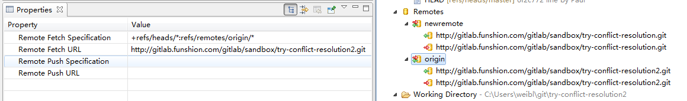
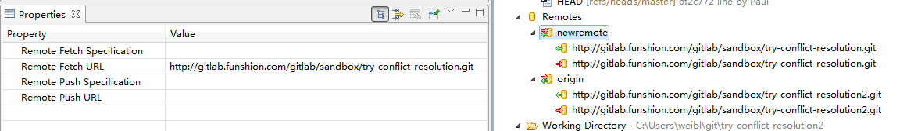
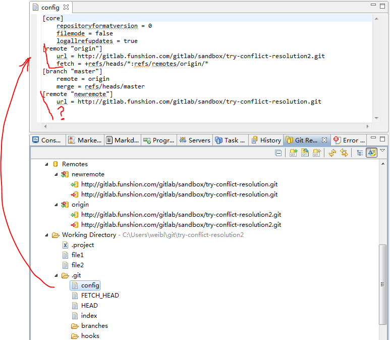

# Git/EGit Notes

It is nice that Eclipse goes now with [EGit](http://eclipse.org/egit/)
 (git client on top of [JGit Java implementation of Git](http://www.eclipse.org/jgit/)).
This means that for basic operations you don't need `git` command line tool
 (and to install [msysgit](http://msysgit.github.io/), if you are on Windows).
However EGit introduces its own features and bugs, and some time or for some operations, you should wish to have 'git'.
I recommend `git` to be installed, and use it to get another view or for some specific operations.

## Remote

`git remote` is used to specify location of git repository on server.

> Q: The current branch is not configured for pull No value for key branch.master.merge found in configuration

A:Your local master branch is not set up to track remote master branch.

You could do `git pull origin master` to tell git the explicit branch you want to pull or you add this to your `.git/config`:

	[branch "master"]
	    remote = origin
	    merge = refs/heads/master

When you push to master for the first time, add the `-u` switch (`git push -u origin master`). This will set everything up automatically.

Your `.git/config` should look like

	[core]
		repositoryformatversion = 0
		filemode = false
		logallrefupdates = true
	[remote "origin"]
		url = https://github.com/use/project.git
		fetch = +refs/heads/*:refs/remotes/origin/*
	[branch "master"]
	    remote = origin
	    merge = refs/heads/master

###  git remotes in Eclipse Kepler

Use Properties View to look at remote values

newremote remote was added using EGit, notice that Specifiation is missing

Look at `.git/config` file

As usual, final point were set after looking at documentation.  
<http://wiki.eclipse.org/EGit/User_Guide#Adding_a_Remote_Configuration>
Though it takes time, in the end it take less time to read documentation, than solve arising issues one by one.

## pull & push

> Q: pull with uncommitted changes
A:

	git stash
	git pull
	git stash apply

Try `git help stash`

### Examples

#### Pulling into a dirty tree

	$ git pull
	...
	file foobar not up to date, cannot merge.
	$ git stash
	$ git pull
	$ git stash pop

#### Interrupted workflow

    ... hack hack hack ...
    $ git stash
    $ edit emergency fix
    $ git commit -a -m "Fix in a hurry"
    $ git stash pop
    ... continue hacking ...

