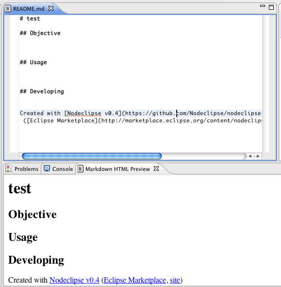
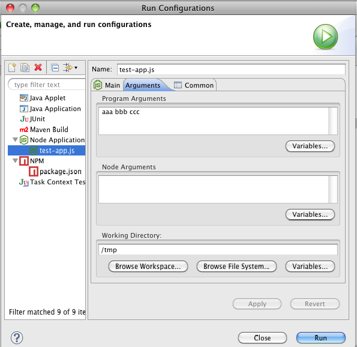
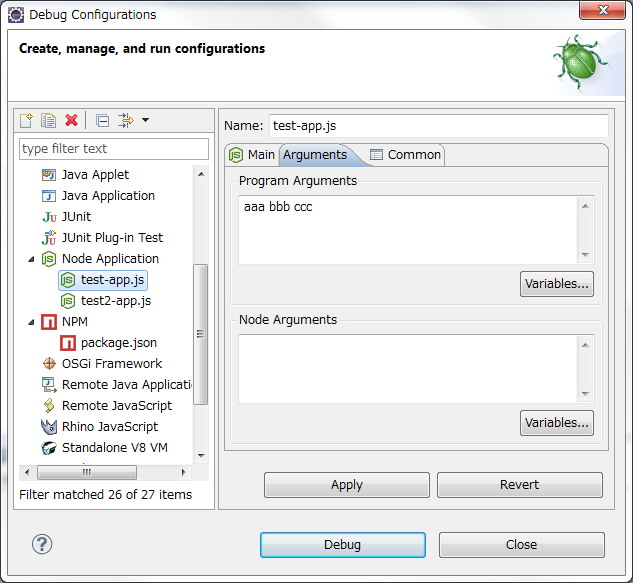

# Version History

Suggest new and vote for <a href="http://nodeclipse.uservoice.com/forums/216804-general">ideas for Nodeclipse</a>
or raise an [issue](https://github.com/Nodeclipse/nodeclipse-1/issues).

[10 ways to support free software you love, 9 won’t cost you a dime](/support-us)

<!-- 
Try it from Enide sources. [Check README](https://github.com/Nodeclipse/nodeclipse-1#maven-build)
-->
Reminder: reset perspective after an update for new UI elements to appear.

### Version 2014-02-??

- features contributed via [GitHub](https://github.com/Nodeclipse/nodeclipse-1) 

<!-- --> 
### Version 0.9.0 "completions 1/2",  2014-01-03

- [#97](https://github.com/Nodeclipse/nodeclipse-1/issues/97) set NODE_JUST_NODE on Windows only;
 so that new users on other OSes, check preferences first.
- in Node.js project Wizard select what template to use. (The same list as for 
 [Nodeclipse CLI](https://github.com/Nodeclipse/nodeclipse-1/tree/master/org.nodeclipse.ui/templates) `npm i -g nodeclipse` )
- new hello-html, hello-coffee, hello-typescript templates
- workspace-wide NODE_OPTIONS (set in Preferences).
This lets you run node(1) with the `--harmony` flag that is needed to enable __generators__ support (since __node 0.11.9__).
And yes, you still can set Node arguments in __Node.js Application__ Run/Debug LaunchConfiguration per every file you launch.
- workspace-wide NODE_APPLICATION_ARGUMENTS (set in Preferences). Similarly, arguments from Preferences
 and from arguments from LaunchConfiguration are all applied.
- ref [#95](https://github.com/Nodeclipse/nodeclipse-1/issues/95)
 (when Node.js sources directory is selected in Preferences)
 automatically link to Node.js sources `lib` directory. It is actually quick & lazy implementation
 just by adding LinkedFolder into `.project` like 

		<linkedResources>
		    <link>
		        <name>node_lib</name>
		        <type>2</type>
		        <location>D:/Nodejs/sources/node-v0.10.22/lib</location>
		    </link>
		</linkedResources>

(`.settings/com.eclipsesource.jshint.ui.prefs` file was updated to exclude `node_lib` from JSHint processing).  
Note that linked JavaScript is not read-only, so if you references git clone of Node.js sources, 
you are ready to develop Node.js runtime)

- as work in progress (for Nodeclipse Node.js Editor associated by default with `*.njs` files)
 code completion for base Node.js modules
 shows [APIs](http://www.nodejs.org/api/) ([sources](https://github.com/joyent/node/tree/master/doc/api)).
- and [completion proposals](https://github.com/Enide/nodeclipse-1/blob/master/org.nodeclipse.ui/src/org/nodeclipse/ui/contentassist/completions.json).
 Point in Preferences to local `completion.json` to define your own, or to empty file like snippet below to disable it:
 
	{
	    "completions": [
	        {
	            "trigger": "ArrayBuffer();"
	        },
	        {
	            "trigger": "Int8Array();"
	        }
		]
	}	
 
- there sprint goal was to make Node specific content assist in Node JSDT-based Editor,
 however I [Paul Verest] ran into problem that can't be solved quickly:  
 [Content assist with javaCompletionProposalComputer for Eclipse JSDT gives no proposal](http://stackoverflow.com/questions/20779899/content-assist-with-javacompletionproposalcomputer-for-eclipse-jsdt-gives-no-pro)    

### Version 0.8 "wizards",  2013-12-02

- jshtml and hogan.js template engines in [Express Wizard](https://github.com/Nodeclipse/nodeclipse-1/blob/master/org.nodeclipse.ui/src/org/nodeclipse/ui/wizards/ExpressProjectWizardPage.java#L215-L225)
- Stylesheet engines selection in Express Wizard (however correctly generated command line execution gives css only on Windows)
- PhantomJS wizard
- Nashorn wizard
- less strict [JSHint defaults][14]
- update [GFMV][3] to 1.7
- add less known Other Optional Tools:

	- [Glance by Xored](http://ystrot.github.io/glance/) (Highlight anywhere, Ctrl+Alt+F; lets you search almost every place in Eclipse you can imagine)
	- [PracticallyMacro by Ernest Pasour](http://sourceforge.net/projects/practicalmacro/) (Macros for Editors using [BeanShell.org](http://www.beanshell.org/))  
	- [EclipseRunner by Lukasz Wachowicz and Bartosz Roznowski (Runner View)](http://code.google.com/p/eclipserunnerplugin/)
	- [SelectionExplorer (PDE) by Sandip Chitales](http://code.google.com/p/sandipchitaleseclipseplugins/#Selection_Explorer)

- Known issues: markdown.editor.feature is missing inside 0.8.0 update repository.
 Check for Markdown Editor inside [Nodeclipse Plugins List](http://www.nodeclipse.org/updates/list)
 or use update site
<pre>http://dl.bintray.com/enide/Markdown/1.0.0/</pre> 
 

### Version 0.7 "run it!", 2013-11-01

- allow many Node.js application running, add Debug View in Node perspective to check and terminate processes
- optional support for [PhantomJS][8] (run)
- optional support for [Nashorn JJS][9] (run)
- optional support for [MongoDB][13] Shell (running scripts)
- disable JSDT validation; enable JSHint validation for `*.json, *.njs, *.pjs, *.jjs, *.mjs, *.jshintrc` files
- add the most strict [`.jshintrc` template][14]
- Help content with tutorials, links and examples, that you can [edit online with GitHub][10]
- Update [Github Flavored Markdown Viewer][3] by Satyagraha, [StartExplorer][4] by Bastian Krol,
 Nodeclipse [Git Addon][6] by Paul Verest,   
 [JSHint][15] integration for Eclipse, [developed by Ralf Stenberg at EclipseSource][16]
- Add [Icons Editor](http://code.google.com/a/eclipselabs.org/p/eclipse-icons-editor/) 2.4.0 as `*.png` Editor by Jabier Martinez (requires org.eclipse.draw2d), 
 PDE-Tools [mp](http://marketplace.eclipse.org/content/pde-tools),[sources](https://github.com/jeeeyul/pde-tools) by Jeeeyul, 
 Regular Expression [Eclipse Regexp](http://marketplace.eclipse.org/content/eclipse-regexp) [github](https://github.com/zapletnev/eclipse-regexp) by Igor Zapletnev,
 MonjaDB (MongoDB GUI) by Kanatoko Anvil [sources](https://github.com/Kanatoko/MonjaDB), [mp](http://marketplace.eclipse.org/content/monjadb)
- Known issues: [gfm_viewer#39](https://github.com/satyagraha/gfm_viewer/issues/39) NPE while debugging (GFM View in Node, not Debug perspective).
 Just close GFM View when about to debug. (Recommended is keep an eye on errors in Error Log View).
 
  [8]: http://phantomjs.org/
  [9]: https://blogs.oracle.com/nashorn/
  [13]: http://www.mongodb.org/
  [14]: https://github.com/Nodeclipse/nodeclipse-1/blob/master/org.nodeclipse.ui/templates/common-templates/.jshintrc

### Version 0.6, 2013-10-06

- Option to launch Node debug without -brk (disable interruption of Node.js app on the first line).
 Check Help (<kbd>F1</kbd>) Debug page on -debug-brk option.
- [#61](https://github.com/Nodeclipse/nodeclipse-1/issues/61) set debugging port in Preferences.
 Now you can debug several Node.js apps in the same time (but in different Eclipse instances).
- [Extended Help with examples and links][10]. 
 Ready for contribution: just edit online with GitHub.
- Chromium JS Editor now has Outline support as Node Editor
<!--
[#49](https://github.com/Nodeclipse/nodeclipse-1/issues/49) support black background color schemes
 for Chromium JS Editor (used in debug mode). That is good for Aptana users where default theme is dark.
-->
- TODO: 2 items below have run into problem <http://stackoverflow.com/questions/19157302/eclipse-plugin-development-saved-launchconfiguration-overrides-launchtype> ,
 that limits their usability (also warning in Help). Decision was made not to postpone release of features above
 and have more frequent releases
	- more support for [CoffeeScript][1] (launch `coffee` util in RUN or DEBUG mode) & [TypeScript][2] (`tsc` compiler).
	 Note that full featured CoffeeScript debugging [#12][12] is not yet implemented.
	 Do you know Java library for parsing `coffee`-generated SourceMaps? [#12][12]
	- [#57](https://github.com/Nodeclipse/nodeclipse-1/issues/57) running app.js with node-dev, forever, supervisor, nodemon etc.
	 Default preferences to `node-dev`.
- Integrate [Github Flavored Markdown Viewer][3] by Satyagraha, [RestClient Tool](/restclient-tool) by Yadu Vendra,
 [StartExplorer][4] by Bastian Krol,
 Nodeclipse [Git Addon][6] & [Plugins List][7] by Paul Verest 

  [1]: http://coffeescript.org/
  [2]: http://www.typescriptlang.org/
  [3]: https://github.com/satyagraha/gfm_viewer
  [4]: http://basti1302.github.io/startexplorer/
  [6]: http://www.nodeclipse.org/git/addon/
  [7]: https://marketplace.eclipse.org/content/nodeclipse-plugins-list
  [10]: https://github.com/Nodeclipse/nodeclipse-1/tree/master/org.nodeclipse.help/contents#intro
  [12]: https://github.com/Nodeclipse/nodeclipse-1/issues/12
  
   
### Version 0.5, 2013-09-08

- [#59](https://github.com/Nodeclipse/nodeclipse-1/issues/59) setting environment variables in Launch (Run/Debug Configuration)
- [#26](https://github.com/Nodeclipse/nodeclipse-1/issues/26) [CoffeeScript support](http://coffeescript.org): run `*.coffee` files 
<!-- 
and `*.litcoffee` files,
 associate `*.litcoffee` ( [Literate CoffeeScript](http://coffeescript.org/#literate) ) with Markdown Editor.
 Check for [letarate programming](http://www.google.com.hk/search?q=letarate+programming).
-->
- [#17](https://github.com/Nodeclipse/nodeclipse-1/issues/17) bundle [Express](http://expressjs.org/) and CoffeeScript into jar files.
 This lets you install them even if you don't have admin permission on computer that you use, or if you want play quickly with Node.js 
 and don't remember how to do `npm install express -g`. Note this bundle is of current Express/CoffeeScript versions, and doesn't
 check for your Node.js version compatibility (the latest version is assumed).
- [#66](https://github.com/Nodeclipse/nodeclipse-1/issues/66) built-in (Help -> Help Contents) and
 [online help](https://github.com/Nodeclipse/nodeclipse-1/tree/master/org.nodeclipse.help/contents). It is open-sourced and written in Markdown.
 [Welcome to contribute](https://github.com/Nodeclipse/nodeclipse-1/tree/master/org.nodeclipse.help/contents):
 just edit Markdown files online, then send pull request.
- [#40](https://github.com/Nodeclipse/nodeclipse-1/issues/40) [maven](http://maven.apache.org/) build.
 Building Nodeclipse is now the easiest `mvn package` from command line. [Check README](https://github.com/Nodeclipse/nodeclipse-1#maven-build)

### Version 0.4, 2013-05-19

<ul>
<li>Integration with JSDT (Code Assist and Outline) 
<a href="https://github.com/Nodeclipse/nodeclipse-1/issues/11">#11 [Feature request] Outlines and other things for class-y structure?</a> 

</li>
<li>Integration with Markdown viewer 
<a href="https://github.com/Nodeclipse/nodeclipse-1/issues/29">29 Integrate Markdown Editor, add Markdown HTML preview to Node perspective</a> 

</li>
<li><a href="https://github.com/Nodeclipse/nodeclipse-1/issues/37">#37 Enhancement: Ability to set a working directory</a> 

</li>
<li><a href="https://github.com/Nodeclipse/nodeclipse-1/issues/36">#36 Associate *.json files with JS Editor</a></li>
<li><a href="https://github.com/Nodeclipse/nodeclipse-1/issues/25">#25 Node perspective doesn't support working sets</a></li>
</ul>

### Version ver 0.3, 2013-04

- Add support for [JSHint][15] integration for Eclipse, [developed by Ralf Stenberg at EclipseSource][16]  
	You had to set project property for JSHint for each project creating. It was boring task. 
	Nodeclipse 0.3 will set them automatically when generating Node project and Express project. 
	You should install JSHint integration for Eclipse. 
	Update site: http://github.eclipsesource.com/jshint-eclipse/updates/
- Update template for new project
	* Add README.md template
	* Add hello-world-server.js
	* Add package.json [(This is good practice)](http://blog.nodejitsu.com/package-dependencies-done-right)
* [Publish](http://marketplace.eclipse.org/quickstart) on Eclipse marketplace
* [t#3 [Feature Request] allow passing arguments](https://github.com/tomotaro1065/nodeclipse/issues/3)
	You can pass arguments to application and node.js setting on [Debug configration...]-[Node Application]-[&ltyour configration name&gt]-[Arguments]. 
	You can also set arguments on [Run configuration...]. 
	
* [n#2 on x64 windows doesn't find NodeJS dir automatically](https://github.com/Nodeclipse/nodeclipse/issues/2)
* [#5 When creating Node project and folder already exists, then add only .project file and don't add 3 files (README.md, hello-world-server.js, package.json)](https://github.com/Nodeclipse/nodeclipse-1/issues/5)
* [#6 Add Express Project in main menu under File -> New (in Node perspective)](https://github.com/Nodeclipse/nodeclipse-1/issues/6) 
	If [Node Express Project] menu does not appear under File->New, reset [Node] perspective by right-clicking on the [Node] button, which is located perspective switching area. 
	

  [15]: http://www.jshint.com/
  [16]: https://github.com/eclipsesource/jshint-eclipse
	
### Version ver 0.2
by Tomoyuki Inagaki 

- Integrating Chromium Development Tools & Debugger ([historical link](http://stackoverflow.com/questions/8159238/eclpse-and-node-js-debug)).

### Version ver 0.1

- Node perspective
- Run as Node application
- Console integration
- npm operations	
- ...
