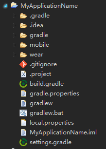
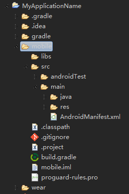
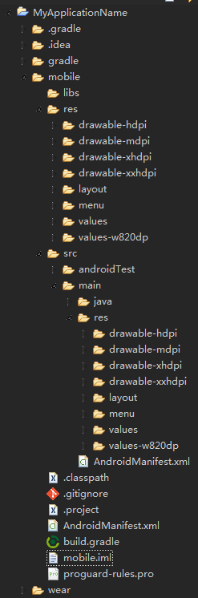
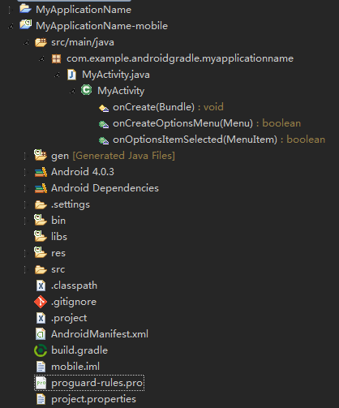

# Gradle for Eclipse - Android

<p></p>

Back to [Android](./) page

#### Importing from Android Studio into Eclipse

**Welcome to raise issue on [GitHub](https://github.com/Nodeclipse/nodeclipse-1/issues).**

First, it is easier to create project with Eclipse-ADT, add `build.gradle` and import into Android Studio
by selecting that `build.gradle`, then other way around.

##### Single-project

see step 2 below

##### Multi-project

Step 1. Add `.project` file into root 

```
<?xml version="1.0" encoding="UTF-8"?>
<projectDescription>
	<name>MyApplicationName</name>
	<comment></comment>
	<projects>
	</projects>
	<buildSpec>
	</buildSpec>
	<natures>
	</natures>
</projectDescription>
```

(you can also use [Nodeclipse CLI](https://github.com/Nodeclipse/nodeclipse-1/tree/master/org.nodeclipse.ui/templates#nodeclipse-cli-commands) )
e.g. from froject root `C:\Users\username\AndroidStudioProjects\MyApplicationName` run `nodeclipse -g`

Copy that path (e.g. in Android Studio "Copy Path" <kbd>Ctrl+Shift+C</kbd>),  
in Eclipse File -> Import -> General / Existing Project into workspace



At this point, you don't really need to have ADT. Eclipse is like Viewer,
 but you already can launch Gradle `build` , `installDebug` or run on Device (when you have defined `run` task).

Further operation you can do within Eclipse. Just customize View to disable `.* resources` filter.

Step 2. For every module (as `mobile` or `wear`) do

2.1 Add 2 standard .files for Android project as below
 (you can get them by creating new project with Eclipse-ADT,
 only need to change `"src" path="src/main/java"`):

- `.project` :

```
<?xml version="1.0" encoding="UTF-8"?>
<projectDescription>
	<name>MyApplicationName-mobile</name>
	<comment></comment>
	<projects>
	</projects>
	<buildSpec>
		<buildCommand>
			<name>com.android.ide.eclipse.adt.ResourceManagerBuilder</name>
			<arguments>
			</arguments>
		</buildCommand>
		<buildCommand>
			<name>com.android.ide.eclipse.adt.PreCompilerBuilder</name>
			<arguments>
			</arguments>
		</buildCommand>
		<buildCommand>
			<name>org.eclipse.jdt.core.javabuilder</name>
			<arguments>
			</arguments>
		</buildCommand>
		<buildCommand>
			<name>com.android.ide.eclipse.adt.ApkBuilder</name>
			<arguments>
			</arguments>
		</buildCommand>
	</buildSpec>
	<natures>
		<nature>com.android.ide.eclipse.adt.AndroidNature</nature>
		<nature>org.eclipse.jdt.core.javanature</nature>
	</natures>
</projectDescription>
```

- `.classpath` :

```
<?xml version="1.0" encoding="UTF-8"?>
<classpath>
	<classpathentry kind="src" path="src/main/java"/>
	<classpathentry kind="src" path="gen"/>
	<classpathentry kind="con" path="com.android.ide.eclipse.adt.ANDROID_FRAMEWORK"/>
	<classpathentry exported="true" kind="con" path="com.android.ide.eclipse.adt.LIBRARIES"/>
	<classpathentry exported="true" kind="con" path="com.android.ide.eclipse.adt.DEPENDENCIES"/>
	<classpathentry kind="output" path="bin/classes"/>
</classpath>
```



2.2 create OS symbolic links

On Lunix

	ln -s src/main/res res
	ln -s src/main/AndroidManifest.xml AndroidManifest.xml

On Windows I don't yet know grace way that would work always:

<http://stackoverflow.com/questions/26081449/symbolic-links-on-windows>

	mklink /D res src/main/res
	mklink AndroidManifest.xml src/main/AndroidManifest.xml

[Windows 7 has `mklink` util](http://www.windows7home.net/how-to-create-symbolic-link-in-windows-7/), but it just did not work on my PC.

I found a great [Junction util](http://technet.microsoft.com/en-us/sysinternals/bb896768.aspx)
 and could do `junction res src/main/res`, but for link to file is created .lnk file (aka Windows shortcut).

I discovered that [Git Bash](http://msysgit.github.io/) can execute `ln -s src/main/AndroidManifest.xml AndroidManifest.xml` but it creates copy, not link.



2.3 Add `gen` folder

2.4 add `project.properties`

```
target=android-15
```

2.5 Import as existing project

click on `mobile` , [<kbd>Ctrl+Alt+C</kbd>](http://www.nodeclipse.org/usage#General-Tools)  
File -> Import -> General / Existing Project into workspace



DONE.

Of course limitations are:

- Eclipse is still using ADT to build 
 (Why not? "To be able to use Gradle-based Android projects in Eclipse, someone will have to write an Eclipse plugin for it, which won't be a trivial task." 
 [answered by Scott Barta](http://stackoverflow.com/questions/23772343/setup-standard-android-project-using-gradle-in-eclipse))
- dependencies added via gradle are not visible to ADT (but jars in `libs` folder are shared of course)

Good things are:

- you can use more stable Eclipse ADT for developing and debugging
- at the same time you can use and/or experiment with [new build system](http://tools.android.com/tech-docs/new-build-system)
 in the same IDE as second one.

