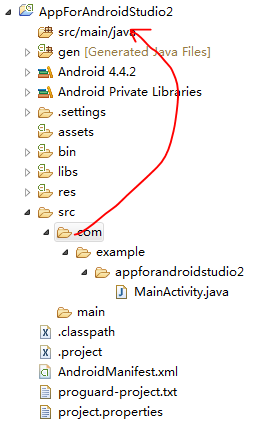
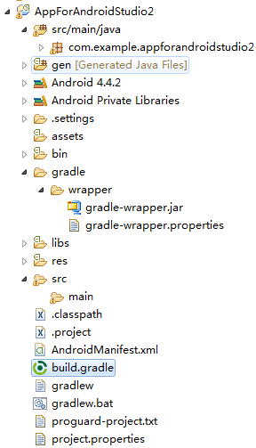
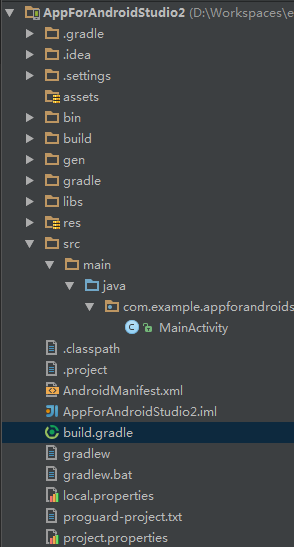

# Gradle for Eclipse - Android

<p></p>

Back to [Android](./) page

#### Make Android Eclipse project ready for Android Studio, yet keeping it accessible for Eclipse use too

In short: use `src/main/java`.

**Welcome to raise issue on [GitHub](https://github.com/Nodeclipse/nodeclipse-1/issues).**


1. Create project in Eclipse
2. In `.classpath` change `src` value into `src/main/java`, that is  
`<classpathentry kind="src" path="src/main/java"/>`  
 ( Your project has red **!** by now)
3. Create folder `main/java` under `src`
4. Move source under `src/main/java`, e.g. move `com` from `src` into `src/main/java` 

	

	Now project compiles well.

5. Way 1: add `build.gradle`, e.g. with such minimal content:

	```groovy
	buildscript {
	    repositories {
	        mavenCentral()
	    }
	    dependencies {
	        classpath 'com.android.tools.build:gradle:0.12.+'
	    }
	}
	apply plugin: 'android'
	
	dependencies {
	    compile fileTree(dir: 'libs', include: '*.jar')
	}
	
	android {
	    compileSdkVersion 19
	    buildToolsVersion "19.1.0"
	
	    sourceSets {
	        main {
	            manifest.srcFile 'AndroidManifest.xml'
	            res.srcDirs = ['res']
	            assets.srcDirs = ['assets']
	        }
	
	        androidTest.setRoot('tests')
	    }
	}
	```	

5. Way 2: Right-click on the project Export... -> Android / Generate Gradle build files.

	In wizard select only project (and its dependencies except for Android support libraries)
	
	This will add `build.gradle` build file and wrapper files: `gradlew`, `gradlew.bat` and `gradle/wrapper` folder.
	
	
	
	Check/correct that your `sourceSets` section is like below:
	
	```groovy	
    sourceSets {
        main {
            manifest.srcFile 'AndroidManifest.xml'
            res.srcDirs = ['res']
            assets.srcDirs = ['assets']
        }
    }
    ```
	
	**Hint 1**: when you Gradle build file becomes long, define some modules and put them into `gradle` folder,
	then inside `build.gradle` use  
	`apply from: 'gradle/feature-module.gradle'`
	
	**Hint 2**: For Eclipse project with dependencies `build.gradle` will be added in every of them,
	and main project will get `settings.gradle`. Instead of Android support library
	add `compile 'com.android.support:appcompat-v7:19.0.+'`
	
6. (optional) If you are using git, add `.gitignore` with 
[content](https://raw.githubusercontent.com/Nodeclipse/nodeclipse-1/master/org.nodeclipse.ui/templates/android-application/.gitignore): 	
	
	``` 
	/gen/
	/bin/
	/.gradle/
	/build/
	/gradle-app.setting	
	.*.md.html	
	.DS_Store
	.idea/workspace.xml
	/local.properties
	```

7. In Android Studio File -> Import Project... and select locate `build.gradle` from the project. 

	

	
Now you can apply power of Gradle in Eclipse with ADT and/or Android Studio

Refs: [1](http://developer.android.com/sdk/installing/migrate.html), [2](http://tools.android.com/tech-docs/new-build-system)

<!-- 
and use feature like 
-->	 