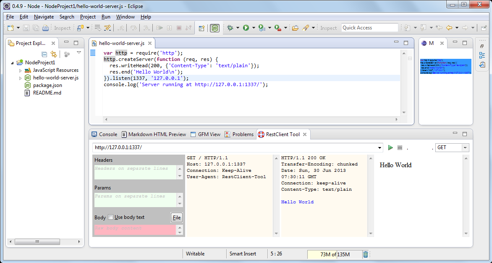

## {{ page.title }}

            	

[REST client tool](https://code.google.com/a/eclipselabs.org/p/restclient-tool/)
 is [REST](http://en.wikipedia.org/wiki/REST) plugin for Eclipse
 that also let's you see low level [HTTP](http://en.wikipedia.org/wiki/HTTP) packet internals (raw client request and server response).
 
It was created by [Yadu Vendra](http://code.google.com/a/eclipselabs.org/u/a1yadu/) ([blog](http://www.yaduvendra.com/)) in 2010.
Sources converted to git are at <https://github.com/Nodeclipse/restclient-tool>.
 
This plugin in distributed within [Nodeclispe NTS](/nts/), [Enide Studio](/enide/studio) and [Enide Monst(e)r](/enide/monster).

You can install plugin from `http://www.nodeclipse.org/updates/`  
It is inside "Enide Tools Collection" group.

### UPDATE Nov 2017

Try similar, but more advanced `http4e` <https://github.com/nextinterfaces/http4e>

### See more in README

[README](README)
