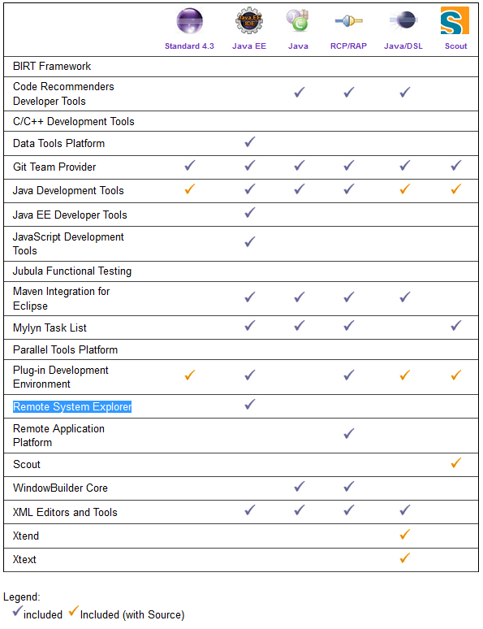

# Version History

nodeclipse-SDK-kepler-win64-0414-20130726.zip (316.6 MB), includes [WindowsBuilder](http://www.eclipse.org/windowbuilder/)

## Nodeclipse SDK (Standard Development Toolkit)

Nodeclipse SDK is published on <a href="https://sourceforge.net/projects/nodeclipse/files/Standard-Development-Kit/">SourceForge</a>.

Nodeclipse SDK is Eclipse distribution like Nodeclipse NTS, but based on Eclipse Standard
 ([compare packages](http://www.eclipse.org/downloads/compare.php?release=kepler)).

See [README](README)